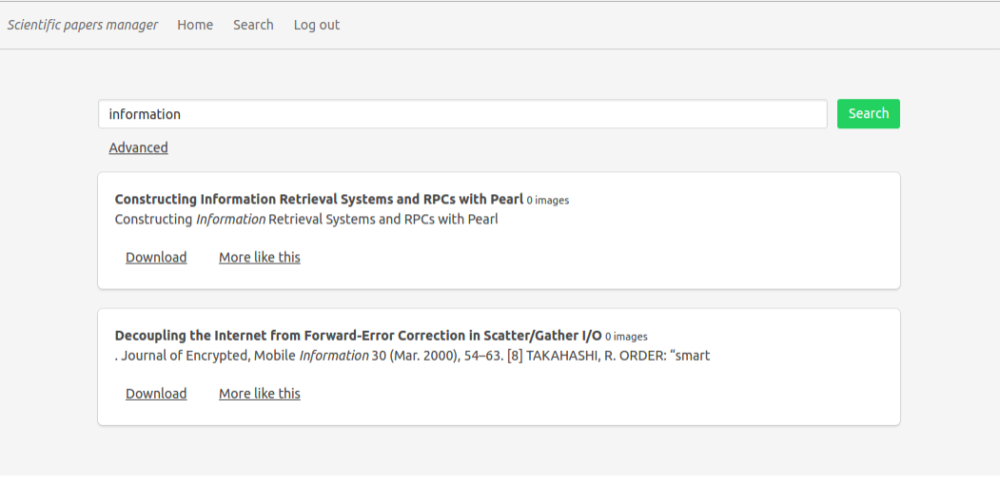

# scientific-papers-manager
 

## About
This is a university project.  It's a part of an assignment within Document Management Systems course.
Basically, it's a web application which enables publishing of the scientific papers and searching through them.

### Technologies
* back-end
  * [Spring Boot](https://projects.spring.io/spring-boot/) (Web, JPA, Security, Mail)
  * [ElasticSearch](https://www.elastic.co/)
* front-end
  * [ReactJS](https://facebook.github.io/react/)
  * [MobX](https://mobx.js.org/)

### Usage
Download the JAR archive from [releases](https://github.com/daliborpavicic/scientific-papers-manager/releases) and run it from command line:
```
java -jar scientific-papers-manager-0.1.0-SNAPSHOT.jar
```
The application is running at [http://localhost:8080](http://localhost:8080)

There are two user accounts present to demonstrate the different levels of access
```
Researcher - user:user
Admin - admin:admin
```
### Features
* publishing scientific papers
  * PDF file upload
  * metadata creation
* searching through the published scientific papers
  * simple search - by entering a query
  * advanced search - combining different type of queries on individual document fields
  * more like this search - finding papers similar to the particular paper
* role based access control - using JWT tokens
  * researcher - can publish papers
  * admin - can search through papers


